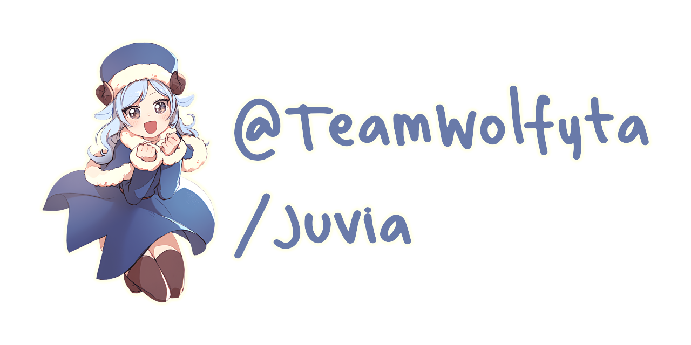

  
  

    
    
    <!-- ALL-CONTRIBUTORS-BADGE:START - Do not remove or modify this section -->

<!-- ALL-CONTRIBUTORS-BADGE:END -->
  

  

    <b>The docker-compose stack that powers my VPS</b>
  

## ✨ Features

- [x] Auto Deployment (Via [GitHub Actions](https://github.com/features/actions))
- [x] Auto Docker Image Updates (Via [Renovate](https://renovatebot.com))
- [x] Traefik V2
- [x] Portainer
- [x] Minio

## ❓ Why is the repo named Juvia?

When choosing the name I wanted it to be anime related while also keeping a connection to docker, I picked Juvia because she is a character from one of my favorite animes [Fairy Tail](https://myanimelist.net/anime/35972/Fairy_Tail__Final_Series) and she is a very powerful Water magic user, Docker's logo is a whale and whales need water :)

## ✨ Contributors

Thanks goes to these wonderful people ([emoji key](https://allcontributors.org/docs/en/emoji-key)):

<!-- ALL-CONTRIBUTORS-LIST:START - Do not remove or modify this section -->
<!-- prettier-ignore-start -->
<!-- markdownlint-disable -->
<table>
  <tbody>
    <tr>
      <td align="center" valign="top" width="14.28%"><a href="https://teamwolfyta.xyz/"> <b>TeamWolfyta</b></a> <a href="https://github.com/TeamWolfyta/@teamwolfyta/juvia/commits?author=TeamWolfyta" title="Code">💻</a> <a href="#design-TeamWolfyta" title="Design">🎨</a> <a href="https://github.com/TeamWolfyta/@teamwolfyta/juvia/commits?author=TeamWolfyta" title="Documentation">📖</a> <a href="#financial-TeamWolfyta" title="Financial">💵</a> <a href="#maintenance-TeamWolfyta" title="Maintenance">🚧</a></td>
    </tr>
  </tbody>
  <tfoot>
    <tr>
      <td align="center" size="13px" colspan="7">
        
          <a href="https://all-contributors.js.org/docs/en/bot/usage">Add your contributions</a>
        </img>
      </td>
    </tr>
  </tfoot>
</table>

<!-- markdownlint-restore -->
<!-- prettier-ignore-end -->

<!-- ALL-CONTRIBUTORS-LIST:END -->

This project follows the [all-contributors](https://github.com/all-contributors/all-contributors) specification. Contributions of any kind welcome!

## 📝 License

This project is licensed under the GNU GPL v3.0 - see the [LICENSE.txt](./LICENSE.txt) file for details
